# TaskManager

TaskManager is a lightweight project and task management application built with Angular. It allows users to create, organize, and track tasks and projects using list or board views. The app includes features like task filtering, project-based grouping, and a dashboard with key statistics. It was created as part of a school project to demonstrate component-based architecture, Angular services, and local data handling.

This project was generated using [Angular CLI](https://github.com/angular/angular-cli) version 19.2.11.

Make sure you have Node.js and Angular CLI installed.

npm install -g @angular/cli

## Development server

To start a local development server, run:

```bash
ng serve
```

Once the server is running, open your browser and navigate to `http://localhost:4200/`. The application will automatically reload whenever you modify any of the source files.

## Code scaffolding

Angular CLI includes powerful code scaffolding tools. To generate a new component, run:

```bash
ng generate component component-name
```

For a complete list of available schematics (such as `components`, `directives`, or `pipes`), run:

```bash
ng generate --help
```

## Building

To build the project run:

```bash
ng build
```

This will compile your project and store the build artifacts in the `dist/` directory. By default, the production build optimizes your application for performance and speed.

## Running unit tests

To execute unit tests with the [Karma](https://karma-runner.github.io) test runner, use the following command:

```bash
ng test
```

## Running end-to-end tests

For end-to-end (e2e) testing, run:

```bash
ng e2e
```

Angular CLI does not come with an end-to-end testing framework by default. You can choose one that suits your needs.

## Additional Resources

For more information on using the Angular CLI, including detailed command references, visit the [Angular CLI Overview and Command Reference](https://angular.dev/tools/cli) page.

## ✅ Features Implemented

- Create, edit, delete tasks & projects
- Organize tasks under projects
- Mark tasks as completed
- View tasks & projects in either list view or board view
- Filter tasks by status
- Dashboard that shows statistics for both projects & tasks

## 🛠️ Technical Documentation
  Architecture 
  
    - Frontend: Angular (component-based architecture) 
    - State Management: Angular signals and services (TaskService, ProjectsService) combined with BehaviorSubject for reactive updates 
    - Routing: Angular Router used for navigation between views 
    - Data Handling: Hybrid approach: 
        - Tasks are loaded from a mock API (https://dummyjson.com/todos) on startup and distributed to default projects meant to visually populate the app 
        - Additional tasks are created and stored locally using localStorage 
        - Data is merged and kept in sync across components using RxJS and signals

    Technologies Used
        - Angular 19
        - TypeScript
        - HTML/CSS
        - Angular CLI
        - Angular Material

## 🌐 API Usage
This project does not include a custom backend, but it fetches initial data from a public mock API for demonstration purposes.

        External API Used 
        - URL: https://dummyjson.com/todos   
        - Method: GET 
        - Purpose: Load an initial set of tasks on application startup (limited to 10, and mapped to fit the app's task model)

## 💭 Design Decisions & Challenges
    Design Decisions 
      - Used Angular Material for faster UI development 
      - Decided to use services to manage task data across components 
      - Kept routing simple: one route for project overview, one for task overview

    Challenges
        - Managing component communication was tricky at first
        - Learned how to use @Input() and @Output() for data flow
        - Styling was difficult to make responsive on small screens
        - Angular Material made it difficult to be more creative with styling choices
        - Made it much harder for myself by not utilizing signals and custom directives & pipes earlier in the process of the project

## 📸 Screenshots

### Dashboard

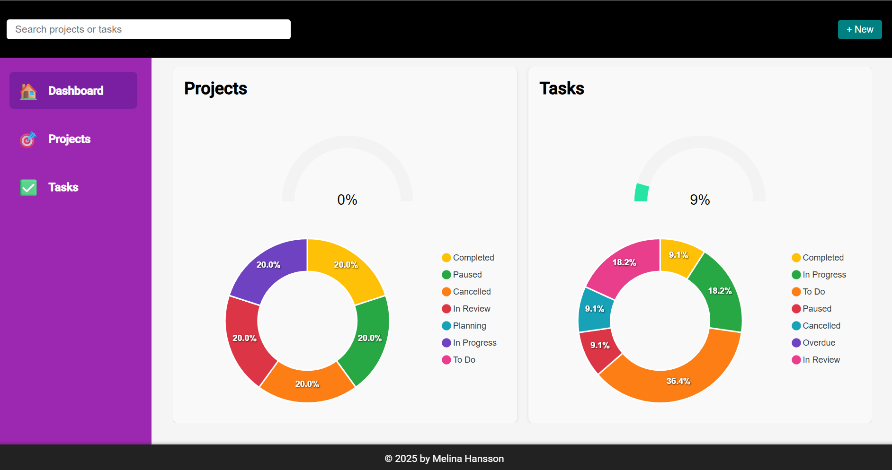

### Projects

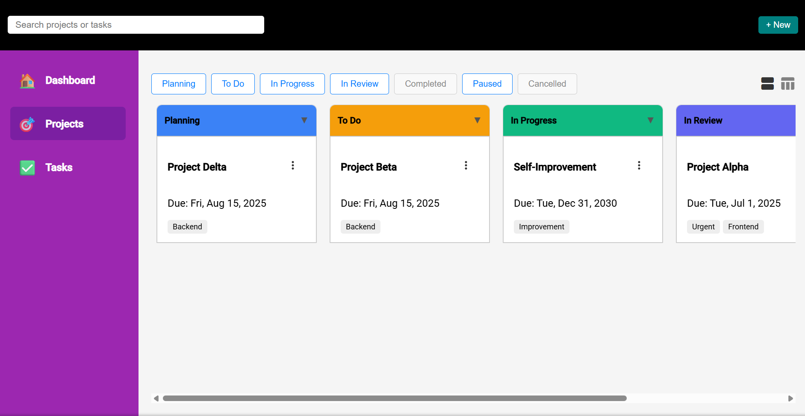
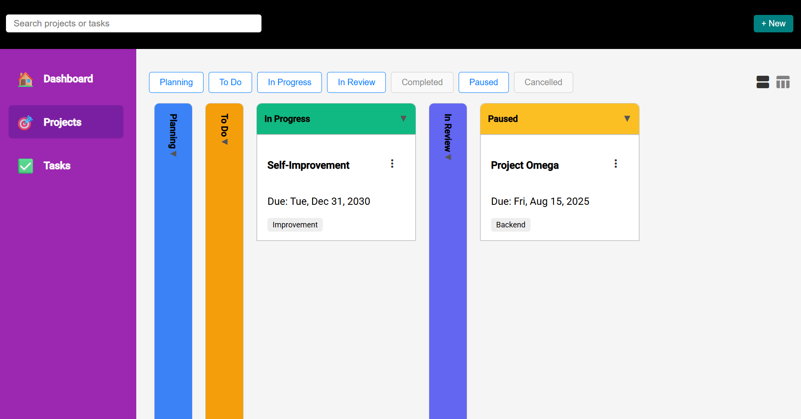
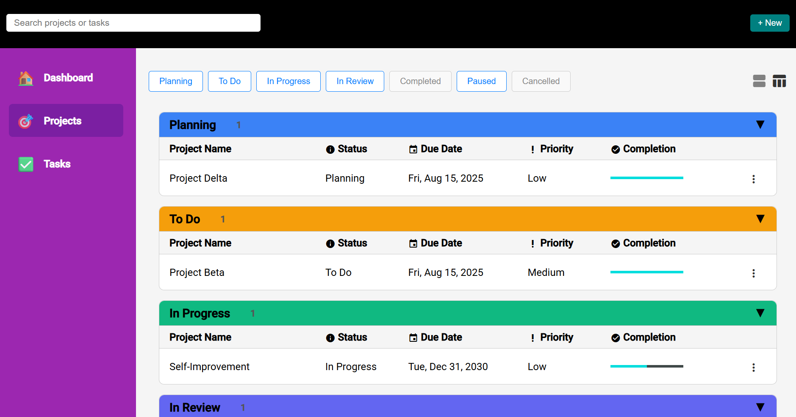
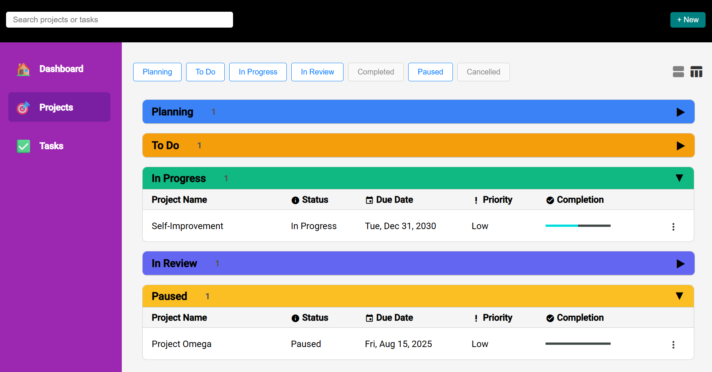
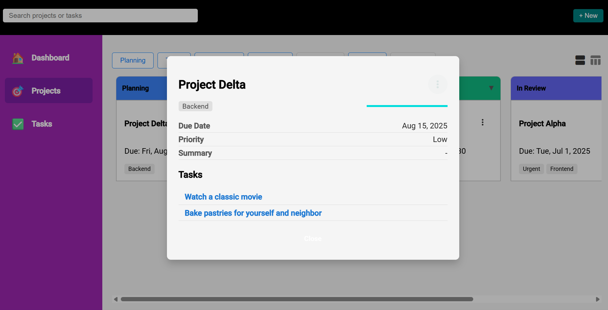

### Tasks

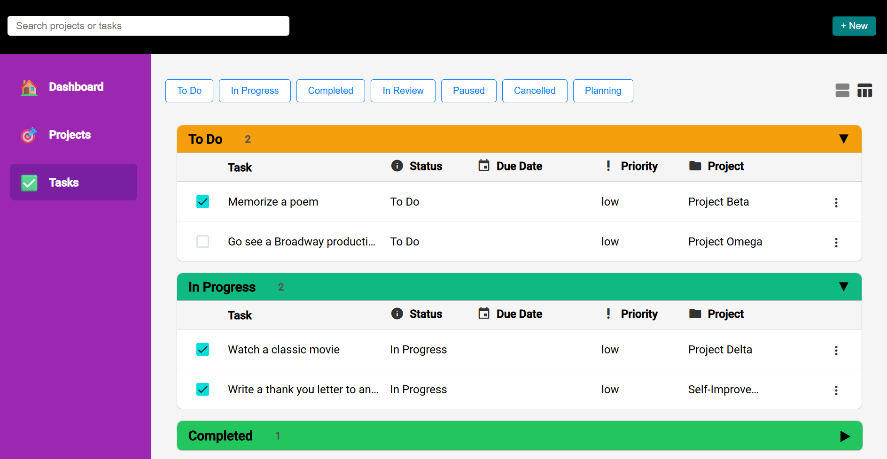
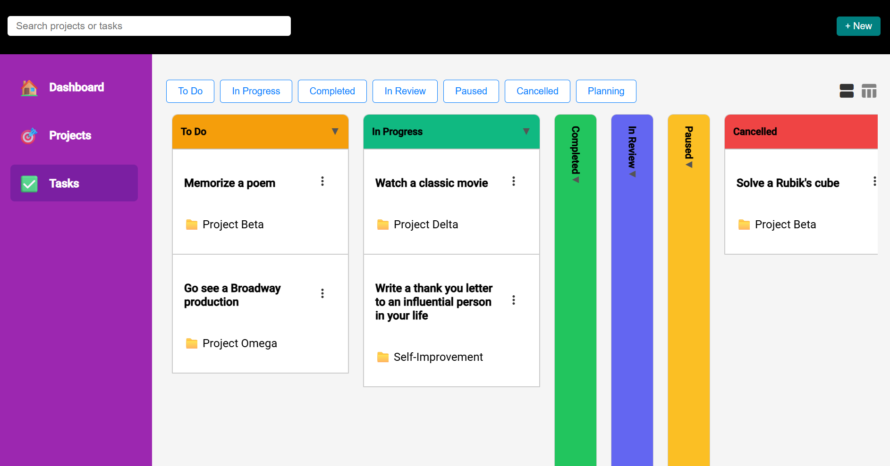
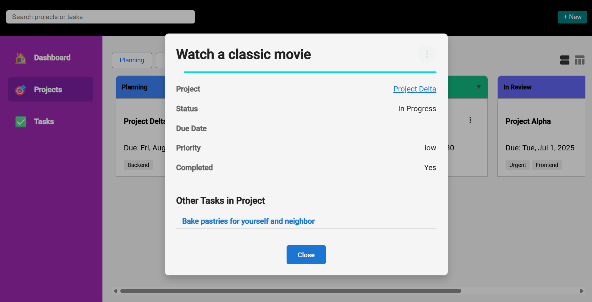

### Create Project Form

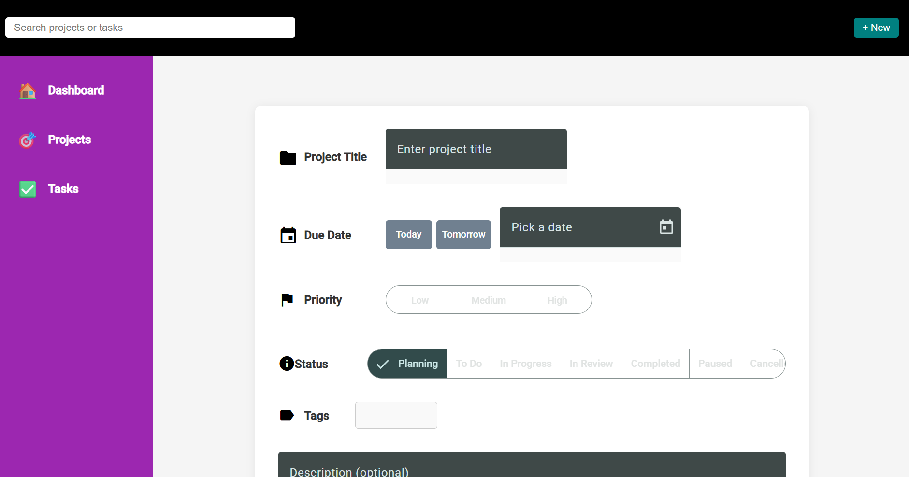

### Create Task Form

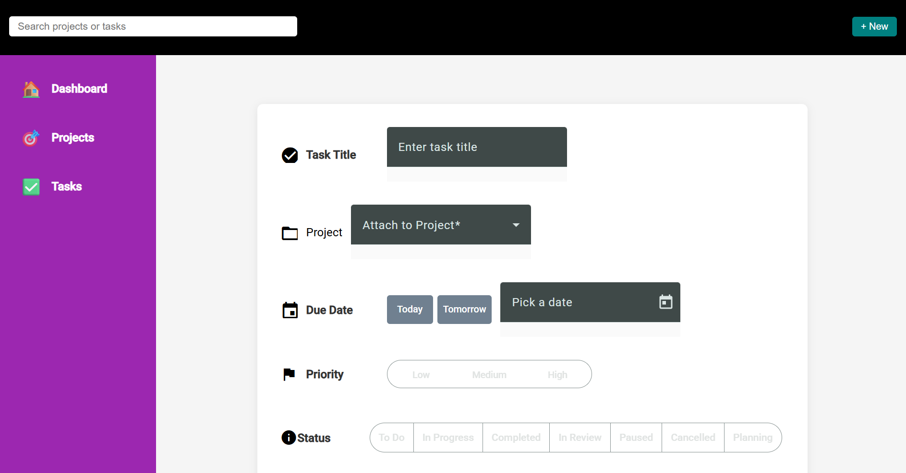
